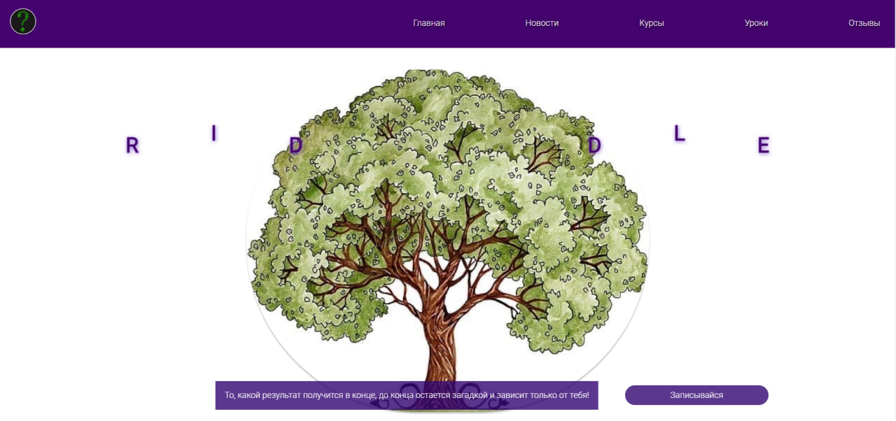
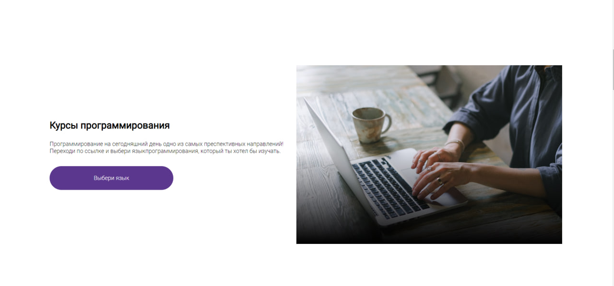
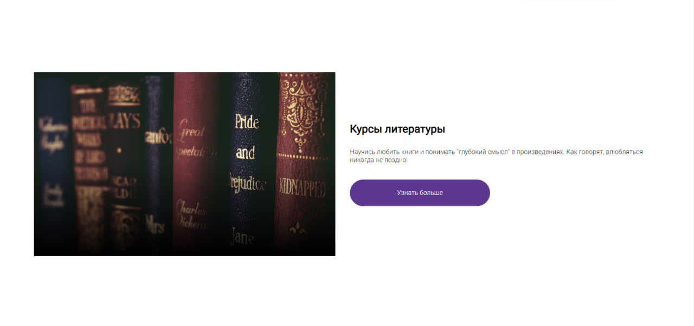
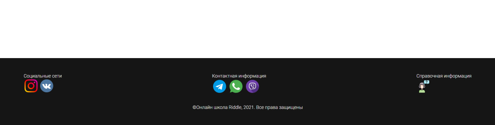
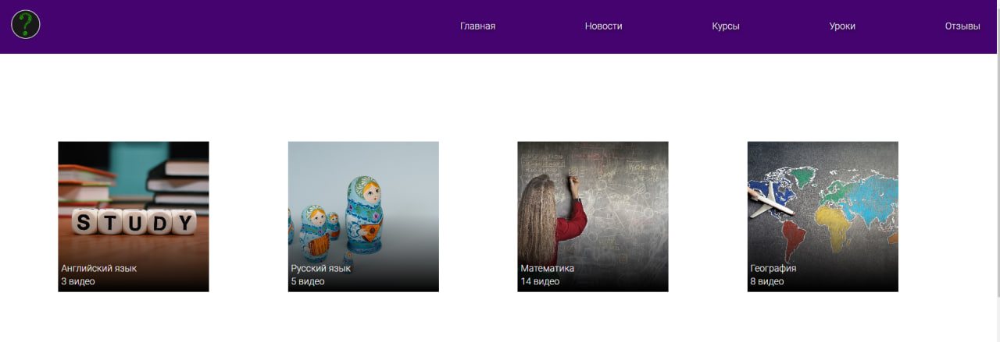
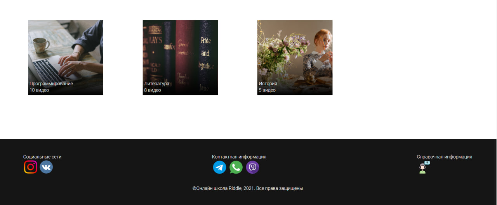

# Riddle Lessons Website Project
### Online school Kodland (autumn 2020)

This repository contains the source code for the **Riddle Lessons** website, an educational platform for the **Riddle** online school. The site is built using HTML and CSS, featuring a responsive design and interactive elements tailored to provide a seamless learning experience.

## Features

- **Home page**: A welcoming page with the main elements of the website.
- **Courses page**: Displays various courses available on the platform.
- **Lessons page**: Lists available lessons by subject.
- **Responsive design**: The layout adapts to various screen sizes, including desktop, tablet, and mobile views.

## Files

1. **`index.html`**: The homepage.
2. **`courses.html`**: Page showcasing the available courses.
3. **`lessons.html`**: Page listing lessons by subject.
4. **`style.css`**: Main CSS file for overall site styling.
5. **`courses.css`**: CSS specific to the courses page.
6. **`lessons.css`**: CSS specific to the lessons page.
7. **`others.css`**: Additional CSS for shared elements and responsive adjustments.

## How to View

1. **Clone the repository**:
    ```bash
    git clone https://github.com/account_username/repository_name.git
    ```

2. **Go to the project directory**:
    ```bash
    cd repository_name
    ```

3. **Open `index.html`**:
    Open the `index.html` file in a web browser to view the homepage. To view the courses and lessons pages, navigate to `courses.html` and `lessons.html`, respectively.

## Technologies

- **HTML**: For webpage structure.
- **CSS**: For styling and responsive design.

## Screenshots

### Home Page


.jpg)

### Courses Page

.jpg)




### Lessons Page




### Responsive Design

.jpg)
